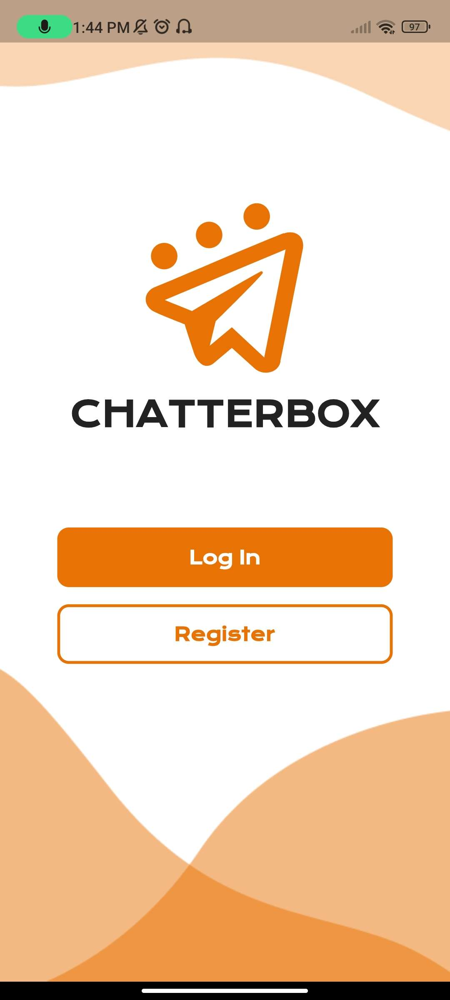
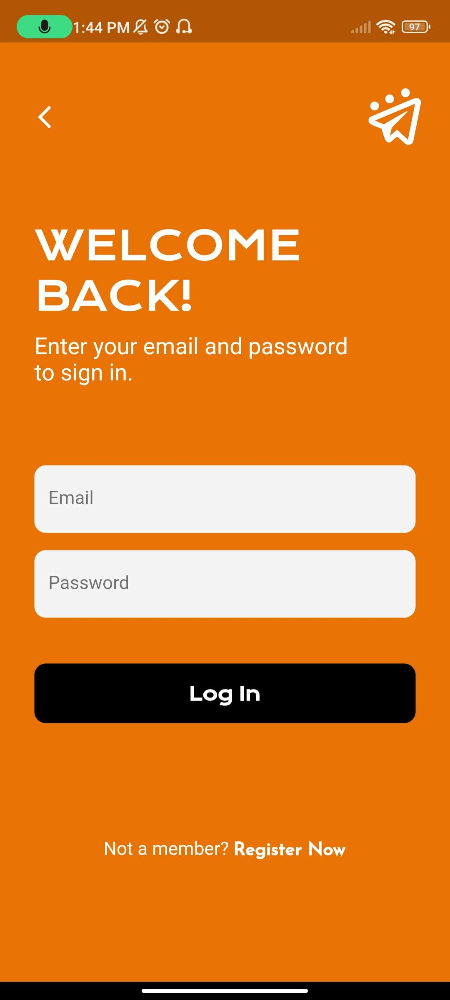
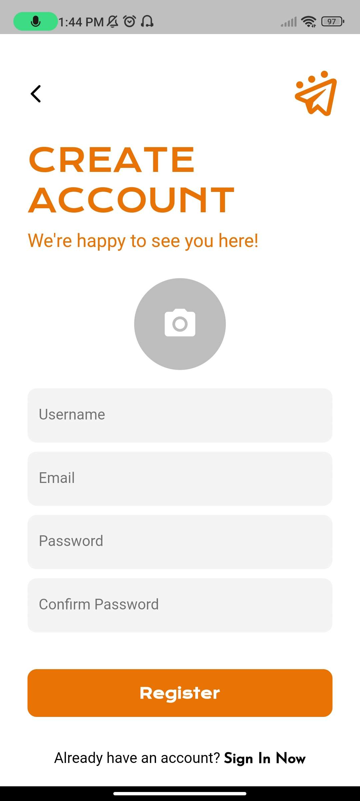
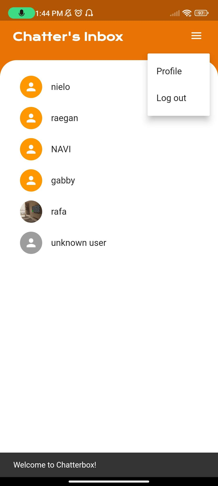
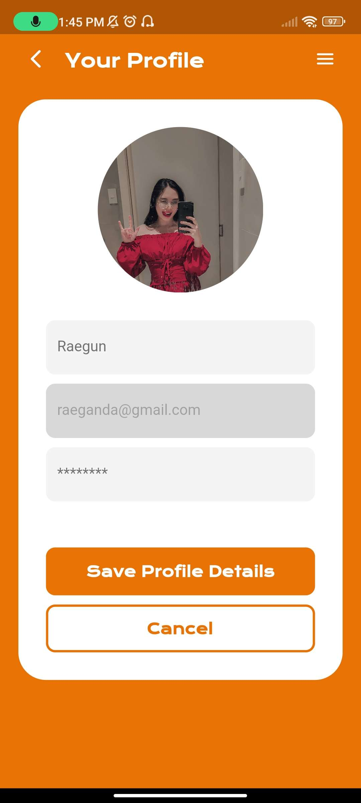

# 📱CHATTERBOX: A MESSAGING APPLICATION
## Introduction

  The "Chatterbox" mobile application stands out as an advanced solution in the 
world of real-time messaging. It's designed is to offer users a smooth and easy way 
to communicate instantly with their loved ones. This app recognizes the increasing 
demand for quick, dependable, and personalized communication. At its core, 
"Chatterbox" lets users send and receive messages in real-time, ensuring that 
conversations happen instantly. Creating a lively and responsive communication 
environment. Navigating through ongoing conversations is simple, allowing users 
to switch between chat threads effortlessly.

  To add a personal touch, "Chatterbox" provides strong profile management 
features. Users can view and edit their profile details. This customization adds a 
personal connection to the messaging experience, making it more engaging. The 
app also respects user privacy and control. Users can delete conversations, giving 
them control over their messaging history and maintaining a privacy. This feature 
adds to a sense of user empowerment. Security is a priority in "Chatterbox," and it 
ensures the integrity of user accounts by integrating Firebase Authentication. This 
guarantees a secure and reliable sign-in and sign-up process, building trust among 
users. For efficient data storage and retrieval, "Chatterbox" relies on Firebase 
Firestore Database. This cloud-based solution not only handles messages 
seamlessly but also ensures data consistency across devices. This integration 
improves the reliability and accessibility of user data, creating a robust and scalable 
infrastructure. In terms of technology, the app is built using the Flutter framework 
with Dart as the programming language. Flutter's cross-platform capabilities 
ensure a consistent and high-quality user interface on both Android and iOS 
devices. This choice of technology emphasizes the commitment to providing a 
cohesive and responsive user experience across different platforms. In conclusion, 
"Chatterbox" is more than just a messaging application; it is a comprehensive 
solution that prioritizes user experience, security, and personalization. By 
combining real-time messaging with intuitive features and a robust technology 
stack, "Chatterbox" emerges as a reliable and modern means of communication in 
the digital age, catering to the evolving needs of users seeking efficient and 
enjoyable messaging experiences.

  In summary, "Chatterbox" is more than just a messaging app; it's a comprehensive 
solution that focuses on user experience, security, and personalization. By 
combining real-time messaging with user-friendly features and a strong technology 
stack, "Chatterbox" emerges as a reliable and modern way of communication in 
the digital age, meeting the evolving needs of users seeking efficient and enjoyable 
messaging experiences.

## Objectives
- Real-time Messaging - enable users to send and receive messages in realtime to facilitate instant communication.
- Multimedia Support – allow users to share not only text messages but also 
multimedia content such as images, videos, and audio clips.
- Intuitive User Interface Design – a user-friendly interface that is easy to 
navigate, ensuring a positive user experience.
- Customization – allow users to customize their profiles, chat backgrounds, 
and notification settings to personalize their experience.

## Significance of the Project

Social Impact to Community Building Chatterbox has the potential to contribute to 
the formation of online communities, bringing people with common interests 
together and fostering a sense of belonging. And Communication for Social 
Causes This application can be used to spread awareness, organize events, and 
mobilize support for social causes, amplifying its positive impact beyond individual 
interactions.

## Scope and Limitation

The "Chatterbox" messaging application is specifically designed to cater to the 
communication needs of the National University Manila community, encompassing 
students, faculty, staff, and other affiliated members. With a primary focus on 
providing a seamless and efficient messaging experience, the application enables 
real-time communication among users, ensuring instant and responsive 
interactions. The scope extends to features such as robust profile management, 
allowing users to personalize their messaging experience by viewing and editing 
their profile details. Additionally, the application prioritizes user privacy and control, 
empowering users to delete conversations and maintain a sense of privacy over 
their messaging history.

"Chatterbox" does not offer third-party integration, meaning it operates as a 
standalone communication platform without incorporating external tools or 
features. Moreover, the app does not include functionalities related to payment 
services or integration with external service providers. These deliberate limitations 
help maintain a focused and secure user experience, ensuring that "Chatterbox" 
remains a dedicated and reliable messaging solution for the National University 
Manila community.

## GUI PREVIEW

  

  

  

  

  

  

## Conclusion and Recommendation

### Conlusion
Chatterbox, as a messaging application, has demonstrated significant potential in 
transforming the way individuals and groups communicate. With its real-time 
messaging, multimedia support, and emphasis on user experience and security, 
Chatterbox addresses the evolving needs of modern communication. The 
application's commitment to end-to-end encryption ensures user privacy, while 
features like group chats, customization options, and third-party integrations 
contribute to a versatile and engaging user experience.

### Recommendation
- User Education – implement onboarding tutorials or guides to help users 
make the most of Chatterbox's features, ensuring a positive initial 
experience.
- Accessibility Features – consider implementing accessibility features to 
ensure that the application is usable by individuals with diverse needs and 
abilities.
- Globalization – expand language support to cater to a broader user base, 
reflecting the application's commitment to global accessibility

